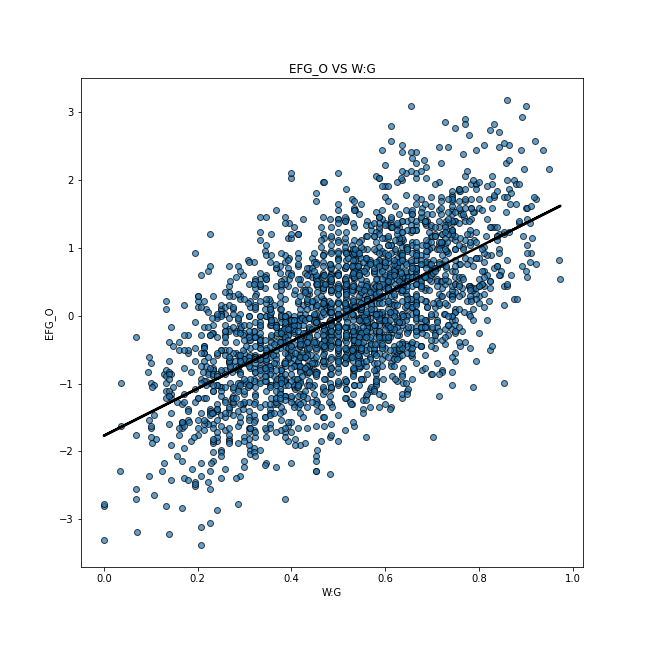
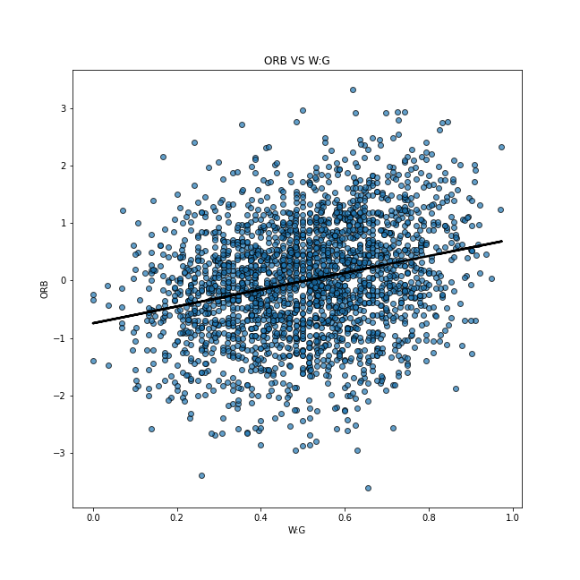
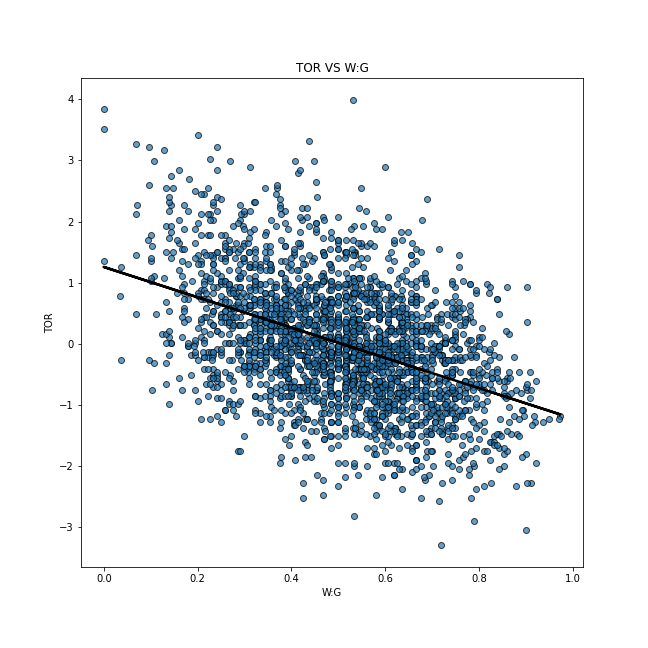
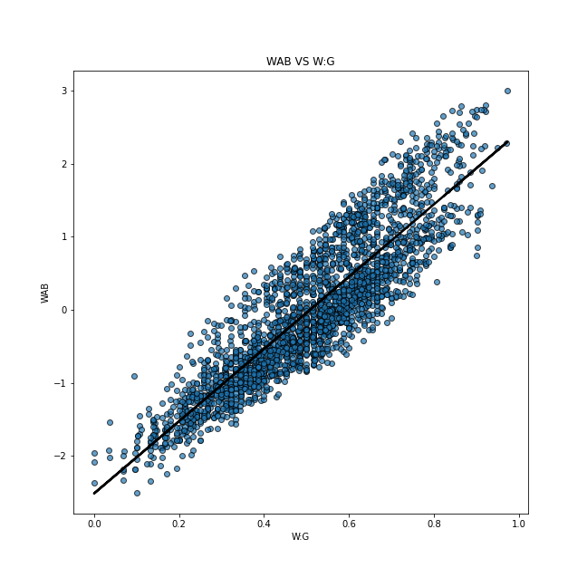
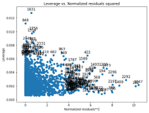

## NCAA Division 1 College Basketball Team Ranker

### Introduction/Background

We have an interest in sports and want to work with the basketball statistics from the 2013-2021 Division 1 college basketball seasons. The first NCAA Division 1 men’s basketball tournament was played in 1939 and the average men’s D1 team plays 35-40 games in a normal season. A college basketball season is broken down into a few segments: non-conference play, conference play, conference tournaments, and postseason tournaments. The vast amount of game time per season generates several important statistics and performance metrics that we can leverage to determine the quality of each team relative to their opposition. By using data modeling techniques and optimizations, the technical team and subject matters can notice valuable insights and recommendations. [1]

### Problem Definition

In the NCAA Division 1 basketball tournament, the winner is the team that scores the most points over the season. Using a dataset, factors such as the number of games played, the number of wins, offensive/defensive efficiency, rebound rate, turnover rate, and free throw rate, will be used to create a team ranking system for each season. The goal of this project is to predict the top 10 teams over multiple seasons by evaluating the efficiency of the system.

### Methods

The method we plan to use to solve this problem falls under supervised learning, specifically using a multi-layer perceptron (MLP) and gradient descent to train the model. We will parameterize the neural network using 3 layers and ReLU activations after each layer. The loss will be defined as an L2 loss over the estimated power ranking score and the labeled power ranking score. Each of the numerical features will be inputted directly into the model while the categorical features will receive a numerical encoding. These features will be merged together to form one input vector to the model of fixed dimension. If we have additional time, we plan to study using Linear Regression and compare the performance of our MLP model with a less complex technique.

### Potential Results 

Significant effort is spent in forecasting the sporting event outcome. Two important strands of sports forecasting are: to obtain the factors that affect the game result and to learn how these factors can be changed so that profitable results can be obtained. [3]

Having access to data like a win to lose ratio and different statistics of the performance of teams from the 2013 - 2021 seasons, we plan to give weights to these statistics based on current basketball trends and calculate the power rating of each team for the next few seasons. We shall first attempt to calculate the weights for each statistic by following the data trendlines that we already have. For instance, if the game has become more offensive, the adjusted offensive efficiency will have more weightage.

### Discussion

We hope to predict the next top 10 NCAA Division I basketball teams in the country over multiple seasons. The data we generate can not only help predict league and playoff results between college basketball teams but also select teams likely to produce future NBA players.

### Results and Discussion

With the several columns in our dataset, our objective was to find the appropriate target feature. Firstly, we thought about using the number of games won in order to decide the ranking of each team. However, we soon realized that the number of games played would also be a factor in this decision. For instance, if a team plays a lot more games than some other team, it is very likely that it wins more games also. But that does not mean that it deserves a higher ranking than a team that plays a smaller number of games. We decided to use the ratio of the number of games won to the number of games played (Win : Game) ratio. Hence, we believe that this target will have a direct correlation with the ranking of the team in the NCAA Division I Basketball championships. In turn, we removed the number of games played (#G) and number of wins (#W) features.

We decided to manually remove a few columns because these had a lot of “Not Applicable” (NA) data and hence would not contribute significantly in predicting our desired outputs. These columns were: round where the given team was eliminated or where their season ended (#POSTSEASON), seed in the NCAA March Madness Torunament (#SEED) and (#YEAR). We believed that the #POSTSEASON values would still be needed and thus decided to convert them to weights for our data. However, we realized that there were too many “NaN” (Not a Number) values, and this would not contribute significantly to our model.

For selecting significant features, we decided to implement Forward Selection. We run OLS on every feature to calculate its p-value. If a feature has a lower p-value, it is more directly correlated to the target value. We run two loops through all the features in our algorithm. In the first loop, we skip over the columns Team Name (#TEAM) and Conference (#CONF) because they are text values. We also skip over the Win to Game ratio column as it is the target value. The first loop determines the best feature we have with the lowest p-value. This ensures that at least one feature gets selected. Our second loop ensures some features get selected based on our significance level, i.e. if the p-value generated by the feature is lesser than the significance value (which acts as a threshold), then the feature gets selected. We tried multiple significant values. For instance, with a significance value of 0.05, we were selecting irrelevant features. Eventually, we got the best results using a significance value of 0.01.

We found that 
Adjusted Offensive Efficiency (An estimate of the offensive efficiency (points scored per 100 possessions) a team
Wins Above Bubble (The bubble refers to the cut off between making the NCAA March Madness Tournament and not
Effective Field Goal Percentage Shot
Turnover Percentage Allowed (Turnover Rate)
Offensive Rebound Rate

were the most relevant features when trying to predict the win rate of a given team. Below are regression plots of each of the features compared to our dependent variable, the win rate.

Adjusted Offensive Efficiency (An estimate of the offensive efficiency (points scored per 100 possessions) a team: This is a good feature to be selected as it has an increasing slope without many outliers.

Effective Field Goal Percentage Shot: This is one of the average features to be selected among the five most significant features we have. It has an increasing trend. The number of outliers is higher than Adjusted Offensive Efficiency and Wins Above Bubble.

Offensive Rebound Rate: This is the worst feature among the five best features we selected. It has an increasing trend and the number of outliers is high.

Turnover Percentage Allowed (Turnover Rate): This is the second worst feature among the five features we selected. It is the only feature we selected with a downward slope. It has a high number of outliers.

Wins Above Bubble (The bubble refers to the cut off between making the NCAA March Madness Tournament and not): This is the best feature we selected. It has an upward trend with a good line of best fit. It has the least number of outliers among all the features.

Then, we utilize the top features from forward selection as the input features for our model. We split our dataset into a training and testing dataset with a ratio of 4:1 between training and testing data. 

Given that we have an output value for each set of features, we can perform supervised learning, specifically Regression, to try and predict a dependent variable, the win rate, given the independent variable, being the selected input features. We chose an Ordinary Least Square Linear Regression model to map the relationship between the input features and the dependent variable. This method works by minimizing the mean squared error in the model by using a closed form solution to solve for the parameters. We fit an Ordinary Least Squares Linear Regression model to this dataset and find that it performs decently well in predicting the win rate. After training our model using the training dataset, we find that it achieves a high R^2 coefficient of 0.985. Another important statistic for this model is the F-statistic which tests a null hypothesis that the model with no independent variables fits the data as well as the learned model. We find that when performing this test, we can undoubtedly reject the null hypothesis in favor of an alternative hypothesis that our model fits the data better than an intercept only model, with a F_statistic of 2.553e+04, p < .01. We also plot the influence of each of the residuals in the model to show the balanced influence of each of the data points on the model without any glaring outliers that could bias it.

In order to see how well the model generalizes to unseen data, we test the model on the reserved test dataset to see how well it performs. We find that there is a performance decline with a R^2 score on the test dataset being 0.875 and the explained variance score, which takes into account the mean of the error, is 0.875. We look at the explained variance score to see if our model is an unbiased estimator which in this case it is since the mean of the residuals is almost 0.

We believe a linear relationship between the independent variables and dependent variables may not capture the true relationship in the data. For the final project, we want to study training more complex nonlinear models such as a Neural Network based model to attempt to model the relationship.

### References

[1] Sarlis, V., & Tjortjis, C. (2020). Sports analytics — Evaluation of basketball players and team performance. In Information Systems (Vol. 93, p. 101562). Elsevier BV. https://doi.org/10.1016/j.is.2020.101562

[2] Terner, Z., & Franks, A. (2021). Modeling Player and Team Performance in Basketball. In Annual Review of Statistics and Its Application (Vol. 8, Issue 1, pp. 1–23). Annual Reviews. https://doi.org/10.1146/annurev-statistics-040720-015536

[3] Jain, S., & Kaur, H. (2017). Machine learning approaches to predict basketball game outcome. In 2017 3rd International Conference on Advances in Computing,Communication & Automation (ICACCA) (Fall). 2017 3rd International Conference on Advances in Computing,Communication & Automation (ICACCA) (Fall). IEEE. https://doi.org/10.1109/icaccaf.2017.8344688

### Timeline

https://gtvault-my.sharepoint.com/:x:/g/personal/snandakumar7_gatech_edu/EZyTNxWZEbFItVvn9XkAQGwBpygKGzXsT3IK7zwTB84_Zg?e=EDf4v6

### Dataset

https://www.kaggle.com/andrewsundberg/college-basketball-dataset?fbclid=IwAR2ZbQ1hw745m661lKiKWHQPnGHdWZJ7rKAHScQUrlVt4zUSVn3-Er9mL5Y
