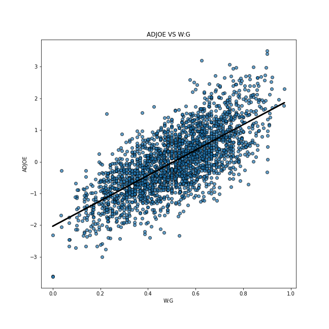
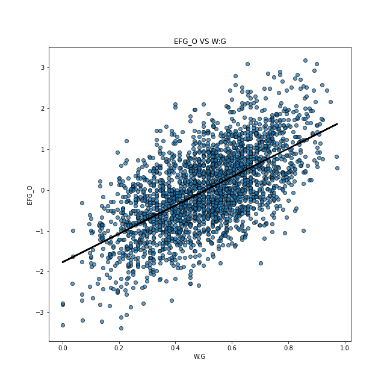
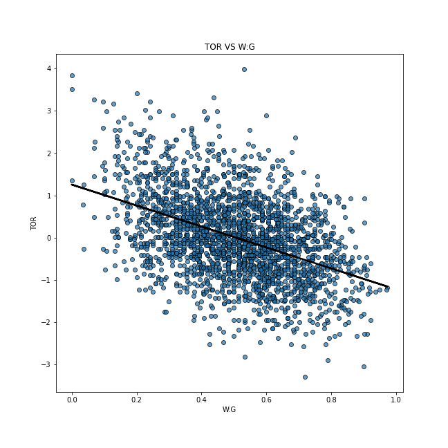
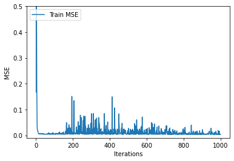
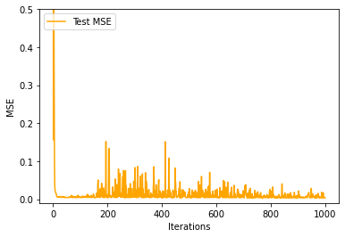

## NCAA Division 1 College Basketball Team Ranker

| GROUP MEMBERS |
| --- |
| Hemang Dash |
| Sravan Jayanthi |
| Sasikumaran Nandakumar |
| Sidarth Rajan |
| Pranav Thomas |

### Introduction/Background

We have an interest in sports and want to work with the basketball statistics from the 2013-2021 Division 1 college basketball seasons. The first NCAA Division 1 men’s basketball tournament was played in 1939 and the average men’s D1 team plays 35-40 games in a normal season. A college basketball season is broken down into a few segments: non-conference play, conference play, conference tournaments, and postseason tournaments. The vast amount of game time per season generates several important statistics and performance metrics that we can leverage to determine the quality of each team relative to their opposition. By using data modeling techniques and optimizations, the technical team and subject matters can notice valuable insights and recommendations. [1]

In popular culture, it has become very common to predict the outcomes of different games (such that even non-sports fans are involved in such activities). Mainstream media outlets also host tournaments online where contestants can enter for free to make their predictions. Due to its reach in the contemporary society, we believed it would be apt for us to make a predictive model for this tournament.

### Problem Definition

In the NCAA Division 1 basketball tournament, the winner is the team that scores the most points over the season. Using a dataset, factors such as the number of games played, the number of wins, offensive/defensive efficiency, rebound rate, turnover rate, and free throw rate, will be used to create a team ranking system for each season. The goal of this project is to predict the top 10 teams over multiple seasons by evaluating the efficiency of the system.

### Methods

The method we plan to use to solve this problem falls under supervised learning, specifically using a multi-layer perceptron (MLP) and gradient descent to train the model. We will parameterize the neural network using 3 layers and ReLU activations after each layer. The loss will be defined as an L2 loss over the estimated power ranking score and the labeled power ranking score. Each of the numerical features will be inputted directly into the model while the categorical features will receive a numerical encoding. These features will be merged together to form one input vector to the model of fixed dimension. If we have additional time, we plan to study using Linear Regression and compare the performance of our MLP model with a less complex technique.

### Potential Results 

Significant effort is spent in forecasting the sporting event outcome. Two important strands of sports forecasting are: to obtain the factors that affect the game result and to learn how these factors can be changed so that profitable results can be obtained. [3]

Having access to data like a win to lose ratio and different statistics of the performance of teams from the 2013 - 2021 seasons, we plan to give weights to these statistics based on current basketball trends and calculate the power rating of each team for the next few seasons. We shall first attempt to calculate the weights for each statistic by following the data trendlines that we already have. For instance, if the game has become more offensive, the adjusted offensive efficiency will have more weightage.

### Discussion

We hope to predict the next top 10 NCAA Division I basketball teams in the country over multiple seasons. The data we generate can not only help predict league and playoff results between college basketball teams but also select teams likely to produce future NBA players.

### Procedure

With the several columns in our dataset, our objective was to find the appropriate target feature. Firstly, we thought about using the number of games won in order to decide the ranking of each team. However, we soon realized that the number of games played would also be a factor in this decision. For instance, if a team plays a lot more games than some other team, it is very likely that it wins more games also. But that does not mean that it deserves a higher ranking than a team that plays a smaller number of games. We decided to use the ratio of the number of games won to the number of games played (Win : Game) ratio. Hence, we believe that this target will have a direct correlation with the ranking of the team in the NCAA Division I Basketball championships. In turn, we removed the number of games played (#G) and number of wins (#W) features.

#### Manual Filtering

We decided to manually remove a few columns because these had a lot of “Not Applicable” (NA) data and hence would not contribute significantly in predicting our desired outputs. These columns were: round where the given team was eliminated or where their season ended (#POSTSEASON), seed in the NCAA March Madness Torunament (#SEED) and (#YEAR). We believed that the #POSTSEASON values would still be needed and thus decided to convert them to weights for our data. However, we realized that there were too many “NaN” (Not a Number) values, and this would not contribute significantly to our model.

#### Forward Selection

For selecting significant features, we decided to implement Forward Selection. We run OLS on every feature to calculate its p-value. If a feature has a lower p-value, it is more directly correlated to the target value. We run two loops through all the features in our algorithm. In the first loop, we skip over the columns Team Name (#TEAM) and Conference (#CONF) because they are text values. We also skip over the Win to Game ratio column as it is the target value. The first loop determines the best feature we have with the lowest p-value. This ensures that at least one feature gets selected. Our second loop ensures some features get selected based on our significance level, i.e. if the p-value generated by the feature is lesser than the significance value (which acts as a threshold), then the feature gets selected. We tried multiple significant values. For instance, with a significance value of 0.05, we were selecting irrelevant features. Eventually, we got the best results using a significance value of 0.01.

We found that 
1. Adjusted Offensive Efficiency (An estimate of the offensive efficiency (points scored per 100 possessions) a team
2. Wins Above Bubble (The bubble refers to the cut off between making the NCAA March Madness Tournament and not
3. Effective Field Goal Percentage Shot
4. Turnover Percentage Allowed (Turnover Rate)
5. Offensive Rebound Rate

were the most relevant features when trying to predict the win rate of a given team. Below are regression plots of each of the features compared to our dependent variable, the win rate.

Adjusted Offensive Efficiency (An estimate of the offensive efficiency (points scored per 100 possessions) a team: This is a good feature to be selected as it has an increasing slope without many outliers.

Effective Field Goal Percentage Shot: This is one of the average features to be selected among the five most significant features we have. It has an increasing trend. The number of outliers is higher than Adjusted Offensive Efficiency and Wins Above Bubble.

Offensive Rebound Rate: This is the worst feature among the five best features we selected. It has an increasing trend and the number of outliers is high.

Turnover Percentage Allowed (Turnover Rate): This is the second worst feature among the five features we selected. It is the only feature we selected with a downward slope. It has a high number of outliers.

Wins Above Bubble (The bubble refers to the cut off between making the NCAA March Madness Tournament and not): This is the best feature we selected. It has an upward trend with a good line of best fit. It has the least number of outliers among all the features.

Then, we utilize the top features from forward selection as the input features for our model. We split our dataset into a training and testing dataset with a ratio of 4:1 between training and testing data.

#### Regression

Given that we have an output value for each set of features, we can perform supervised learning, specifically Regression, to try and predict a dependent variable, the win rate, given the independent variable, being the selected input features. We chose an Ordinary Least Square Linear Regression model to map the relationship between the input features and the dependent variable. This method works by minimizing the mean squared error in the model by using a closed form solution to solve for the parameters. We fit an Ordinary Least Squares Linear Regression model to this dataset and find that it performs decently well in predicting the win rate. After training our model using the training dataset, we find that it achieves a high R^2 coefficient of 0.985. Another important statistic for this model is the F-statistic which tests a null hypothesis that the model with no independent variables fits the data as well as the learned model. We find that when performing this test, we can undoubtedly reject the null hypothesis in favor of an alternative hypothesis that our model fits the data better than an intercept only model, with a F_statistic of 2.553e+04, p < .01. We also plot the influence of each of the residuals in the model to show the balanced influence of each of the data points on the model without any glaring outliers that could bias it.

In order to see how well the model generalizes to unseen data, we test the model on the reserved test dataset to see how well it performs. We find that there is a performance decline with a R^2 score on the test dataset being 0.875 and the explained variance score, which takes into account the mean of the error, is 0.875. We look at the explained variance score to see if our model is an unbiased estimator which in this case it is since the mean of the residuals is almost 0.

We believe a linear relationship between the independent variables and dependent variables may not capture the true relationship in the data. For the final project, we want to study training more complex nonlinear models such as a Neural Network based model to attempt to model the relationship.

#### Neural Network

We study using a 3 layered Neural Network based Multi-Layer Perceptron model to capture the nonlinearities to get a better ranking of the top teams. This model is constructed of multiple layers each which applies a linear matrix multiplication operation then a nonlinear activation function, then passes the outputs to the subsequent next layer. We select a Rectified Linear Unit as our nonlinear activation and pass in the selected features from feature extraction to our model.

We study different architectures of the Network such as 2-layer network with a hidden layer of size 100 but find that an architecture of a 3-layer network with two hidden layers of size 100 each performed best. Additionally, different hyperparameters are studied; starting with an initial learning rate of 1e-3 and an Adam optimizer, our model was able to reach convergence within 10,000 timesteps. However, we modified the optimizer to be a LBFGS optimizer which estimates an inverse Hessian function to update the gradient which is used to calculate the new parameters of each iteration. This allows our model to reach convergence within 1,000 timesteps.

After training our model using the training dataset, we find that it achieves a high R^2 coefficient of 0.985. Another important statistic for this model is the F-statistic which tests a null hypothesis that the model with no independent variables fits the data as well as the learned model. We find that when performing this test, we can undoubtedly reject the null hypothesis in favor of an alternative hypothesis that our model fits the data better than an intercept only model, with a F_statistic of 2.553e+04, p < .01. We also plot the influence of each of the residuals in the model to show the balanced influence of each of the data points on the model without any glaring outliers that could bias it.

After performing a similar split of our training data into a training set and testing set, we train our model for 1,000 steps and find it performs well on the test dataset. Below are the learning curves of our model plotting the training and test Mean Squared Error during each of the iterations of training.

### Results

The model achieves a training and test Mean Squared Error of ~0.003 suggesting the model does a good job minimizing the loss. We also find that the coefficient of determination which is analogous to the R^2 coefficient from the Ordinary Least Squares Linear Regression model for the training dataset is a high 0.914. The Multi-layered perceptron model outperforms the Linear Regression model in the coefficient of determination it achieves on the testing dataset of 0.903, better than the score of 0.875. This suggests that even though the MLP model has a lower training correlation, it does a much better job of generalizing unseen data which is more valuable in our problem domain where we want to predict the future seasons' top 10 teams.

Given that we trained both of our models on a dataset of NCAA College Basketball statistics from 2013-2022, we tested our model on the NCAA College Basketball statistics of the 2021 season and found that our Linear Regression model does a decent job in identifying the top teams. Likewise, our Neural Network based model does quite well by identifying the highest performing teams with respect to the true top teams.

Linear Regression Top 10 in 2021:

| TEAM | SCORE |
| --- | --- |
| Gonzaga | 1.016834 |
| Baylor | 0.950238 |
| Illinois | 0.930538 |
| Colgate | 0.883021 |
| Winthrop | 0.851237 |
| Michigan | 0.845196 |
| Drake | 0.831841 |
| Loyola Chicago | 0.824511 |
| Stephen F. Austin | 0.823829 |
| USC | 0.801104 |

Multi-Layer Perceptron Top 10 in 2021:

| TEAM | SCORE |
| --- | --- |
| Colgate | 0.933563 |
| Winthrop | 0.903266 |
| Gonzaga | 0.898733 |
| Drake | 0.861598 |
| Loyola Chicago | 0.856498 |
| Baylor | 0.848474 |
| Illinois | 0.845733 |
| Prairie View A&M | 0.844561 |
| Abilene Christian | 0.840267 |
| Belmont | 0.837822 |

We compare this to the true outcome of the 2021 season.

True Outcome of the 2021 Season:

| TEAM | RANK |
| --- | --- |
| Gonzaga | 1 |
| Houston | 2 |
| Kansas | 3 |
| Arizona | 4 |
| Baylor | 5 |
| Villanova | 6 |
| Tennessee | 7 |
| Texas Tech | 8 |
| Kentucky | 9 |
| Duke | 10 |

### Summary

We started the project with the goal of being able to predict the top 10 NCAA Division I basketball teams in the United States of America over multiple seasons. We used the College Basketball Dataset from Kaggle. We first manually filtered out the irrelevant columns that we believed would not contribute significantly. Then, we implemented Forward Selection to be able select the top significant features. We applied Linear Regression to the dataset (with the top features) and tested it against some of the data reserved for testing. After this, we pass the data through a 3 layered Neural Network based Multi-Layer Perceptron model and a nonlinear ReLU activation. We then perform the training and testing and plot the mean squared error during each training iteration. With the results, we are able to predict the top 10 teams for the 2021 season and compare it against the true outcome of the 2021 season.

### Conclusion

The training and testing Mean Squared Error using Linear Regression was approximately 0.004, while it was around 0.003 using the Multi-Layer Perceptron model. This shows us that both our models did a good job at being able to assign almost accurate Win: Game ratio scores to different NCAA Division I College Basketball teams.

Through mainstream media predicting inaccurately who might win a game of basketball multiple times, we know that it is difficult to predict the outcomes of individual games of basketball, let alone the rankings of teams in a tournament. With the wide number of statistics, we can use different means by providing different weights to each statistic to reach multiple conclusions in our predictions. However, despite the difficulty of the problem statement posed in front of us, our models did a fairly good job at predicting the top 10 teams in the tournament and still have the potential to produce more valuable information. This can be seen through the error we achieved and by manually comparing the test dataset with our predictions.

We believe that our accuracy could be improved with more training data and tuning the features in our dataset. While adding unnecessary features might not help the model, new features which significantly contribute to the predictions and removing features that are noise will help increase the accuracy of our models. We recommend introducing more data about the season we are planning to predict. If we focused on accuracy alone, we believe that predicting the playoff outcomes would be easier and more accurate than predicting the top 10 rankings in the tournament. In addition to these recommendations, exploring other models in the scope of Deep Learning might also be useful in increasing the accuracy.

### Extensions

We could predict metrics of different NCAA Division I college basketball teams for future years based on previous years’ data using a Time Series model (which is not in the scope of this course).

### Presentation Link

### References

[1] Sarlis, V., & Tjortjis, C. (2020). Sports analytics — Evaluation of basketball players and team performance. In Information Systems (Vol. 93, p. 101562). Elsevier BV. https://doi.org/10.1016/j.is.2020.101562

[2] Terner, Z., & Franks, A. (2021). Modeling Player and Team Performance in Basketball. In Annual Review of Statistics and Its Application (Vol. 8, Issue 1, pp. 1–23). Annual Reviews. https://doi.org/10.1146/annurev-statistics-040720-015536

[3] Jain, S., & Kaur, H. (2017). Machine learning approaches to predict basketball game outcome. In 2017 3rd International Conference on Advances in Computing,Communication & Automation (ICACCA) (Fall). 2017 3rd International Conference on Advances in Computing,Communication & Automation (ICACCA) (Fall). IEEE. https://doi.org/10.1109/icaccaf.2017.8344688

### Timeline

<a href="https://gtvault-my.sharepoint.com/:x:/g/personal/snandakumar7_gatech_edu/EZyTNxWZEbFItVvn9XkAQGwBpygKGzXsT3IK7zwTB84_Zg?e=EDf4v6">Click here to access the timeline on SharePoint</a>

### Dataset

<a href="https://www.kaggle.com/andrewsundberg/college-basketball-dataset?fbclid=IwAR2ZbQ1hw745m661lKiKWHQPnGHdWZJ7rKAHScQUrlVt4zUSVn3-Er9mL5Y">Click here to access the Kaggle dataset</a>
